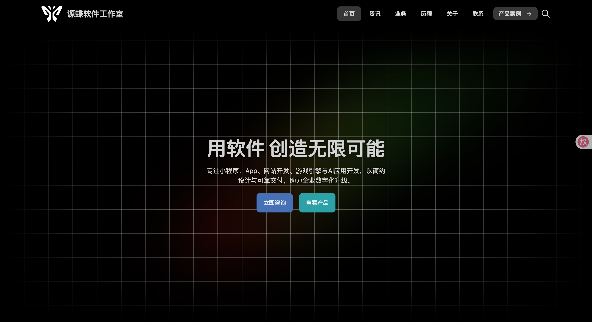

# theme-mdocs · 源蝶文档

> 由 **源蝶Source开发** 维护的 Halo 现代化文档主题，面向技术文档 / 知识库 / 产品手册场景，内置分类树导航与多级文档结构，并为 Docsme、MiniDocs 等文档类插件提供适配页面。

[](https://halo.run)
[](#版本与兼容性)
[](LICENSE)

---

## 这个主题适合谁

| 你的场景 | 用起来的形态 |
| --- | --- |
| 产品手册 / 使用文档 | 一级分类当「文档组」，二级分类当章节，自动生成左侧目录树 + 右侧「本页目录」 |
| 技术知识库 | 配合 MiniDocs 插件，一个页面内翻完整个知识库，不用来回跳转 |
| 开源项目文档 | 配合 Docsme 插件，支持项目级目录与多版本文档切换 |
| 博客 + 文档混合站 | 普通文章走归档 / 标签 / 作者页，文档走文档组，两套体系互不干扰 |

一句话理解：**分类树就是文档的骨架，主题负责把它渲染成左侧导航。**

- **主题版本**：`1.1.0`
- **Halo 要求**：`>= 2.25.0`
- **主题目录名**：`theme-mdocs`（需与 `theme.yaml` 中 `metadata.name` 保持一致）

## 预览



> 上图为真实界面截图，随主题包以 `screenshot.jpg` 一起分发。
> `_notes/screenshots/` 目录下另有「文档详情」「文档中心」两张真实界面截图，提交应用市场时可直接上传作为商店截图。

---

## 快速上手（5 步）

```text
  ① 装主题         ② 建分类         ③ 写文档         ④ 开启文档组      ⑤ 排首页
    外观 → 主题      文章 → 分类      文章 → 新建      主题文档设置      首页设置
    安装 + 启用      一级 + 二级      选分类 + 模板    添加一级分类      添加 / 排序模块
        │                │                │                │                │
        └────────────────┴────────────────┴────────────────┴────────────────┘
                                          │
                                          ▼
                                   访问前台查看效果
```

### 第 1 步：安装并启用主题

后台 → **外观 → 主题** → 找到「源蝶文档」→ 点 **安装** → 点 **启用**。

### 第 2 步：建立分类树

后台 → **文章 → 分类** → 新建分类。建议至少建两层：

```text
一级分类：使用指南          ← 将来作为「文档组」
二级分类：安装部署          ← 将来作为左侧导航里的分组
二级分类：常见问题
```

### 第 3 步：发布文档

后台 → **文章 → 新建**：

1. 填写标题与正文（正文用 `h2` / `h3` 标题，右侧会自动生成目录）；
2. 右侧 **分类** 勾选到第 2 步建好的分类树下；
3. 右侧 **模板** 选择 **文档**；
4. 点击 **发布**。

### 第 4 步：开启文档组

后台 → **外观 → 主题 → 主题设置 → 主题文档设置** → 在「**文档组归档分类**」中添加第 2 步的**一级分类**。

> 关键点：这里要选**最顶级的那个分类**。主题会自动读取它的下级分类来生成左侧目录树；文章只要挂在这棵树下的任意位置即可。

### 第 5 步：配置首页

后台 → **主题设置 → 首页设置 → 首页模块** → 点「**添加模块**」→ 先选「**类型**」，再填该类型对应的字段 → 用拖拽调整模块顺序。

完成后访问前台：

| 页面 | 地址 | 说明 |
| --- | --- | --- |
| 首页 | `/` | 按首页模块顺序渲染 |
| 分类归档（文档组列表） | `/categories` | 展示第 4 步勾选的文档组 |
| 插件文档中心 | `/docs` | Docsme 项目 / MiniDocs 知识库，需先装插件 |

---

## 配置指引

### A. 内容怎么组织（最重要的一节）

```text
后台「文章 → 分类」                              前台表现
──────────────────────────────────────────────────────────────────────
[一级] 使用指南   ◀── 加进「文档组归档分类」      左侧导航一级（可折叠）
   │
   ├─ [二级] 安装部署                             左侧导航里的分组标题
   │     ├─ 环境要求（文章）                       文档页 + 右侧本页目录
   │     └─ 安装步骤（文章）                       文档页 + 右侧本页目录
   │
   └─ [二级] 常见问题
         └─ 如何升级（文章）                       文档页 + 右侧本页目录
```

三条规则：

1. **一个一级分类 = 一个文档组**（要在主题设置里勾选才会启用文档形态）；
2. **二级分类 = 左侧导航里的分组**，可以继续往下嵌套更多层；
3. **文章 = 具体页面**，必须归属到这棵分类树下，否则不会出现在左侧目录树里。

### B. 内容该选哪个模板

| 你在做什么 | 后台位置 | 分类 / 模板怎么选 |
| --- | --- | --- |
| 写一篇文档 | 文章 → 新建 | 分类选到文档组树下 → 模板选 **文档**（`post_documentation.html`） |
| 写一篇普通文章 | 文章 → 新建 | 分类选普通分类 → 模板保持默认 |
| Docsme 文档中心 | 页面 → 新建 | 模板选 **docsme-docs**（`docsme-docs.html`） |
| MiniDocs 知识库中心 | 页面 → 新建 | 模板选 **minidocs-docs**（`minidocs-docs.html`） |

### C. 首页怎么排

```text
「首页设置 → 首页模块」数组顺序 = 页面上到下的顺序

  ① 主视觉      hero-carousel            标题 / 按钮 / 安装方式标签 / 轮播图
  ② 快速开始    quick-start              主推大卡 + 侧边卡片
  ③ 卡片模块    cards                    type1 背景图样式 / type3 图标样式
  ④ 文章分类    ocean-categories         按分类生成卡片
  ⑤ 菜单模块    ocean-menu               展示指定菜单的前 4 个一级菜单项
  ⑥ 推荐文章    ocean-posts              按标签或分类取前 6 篇
  ⑦ 插件模块    plugin-docsme-module     自动读取 Docsme 归档卡片
                plugin-minidocs-module   自动读取 MiniDocs 归档卡片
```

操作方式：点「**添加模块**」→ 选「**类型**」→ 填字段 → 按住拖拽排序；不需要的模块直接删除。

> 默认值里预置了演示模块。正式建站时请把「快速开始」「卡片模块」里的示例文案与示例图片替换成自己的内容。

### D. 插件页面怎么开（Docsme / MiniDocs）

```text
 ① 安装插件          应用市场搜索 Docsme / MiniDocs → 安装 → 启用
        │
        ▼
 ② 开启主题适配      主题设置 → 「Docsme 插件页面」/「MiniDocs 插件页面」→ 打开开关
        │
        ▼
 ③ 新建页面          后台 → 页面 → 新建 → 模板选 docsme-docs / minidocs-docs → 发布
        │
        ▼
 ④ 加入导航          后台 → 菜单 → 新建菜单项指向该页面
                     → 主题设置 → 页眉导航 → 主菜单选择这个菜单
```

> 没有安装插件也没关系：相关入口会自动隐藏，主题其它功能照常使用。

### E. 页眉 / 页脚怎么配

| 想改什么 | 去哪里改 |
| --- | --- |
| Logo（浅色 / 深色） | 全局设置 → 昼间 Logo / 夜间 Logo |
| 主题色、字号、圆角、背景 | 全局设置 |
| 页眉左侧导航按钮（最多 3 个） | 页眉导航 → 左侧导航按钮组 |
| 页眉右侧图标按钮（最多 6 个） | 页眉导航 → User 按钮组（可粘贴 SVG） |
| 主菜单下拉项 | 后台「菜单」建菜单 → 页眉导航 → 选择该菜单 |
| 版权、页脚菜单、ICP / 公安备案 | 页脚设置 |

> 所有跳转类选项默认留空，**留空时对应按钮或卡片不会输出无效链接**；备案号留空时备案栏整体不显示。

### F. 内容页工具栏怎么调

主题设置 → **主题文档设置**：

- 关闭「内容页顶部显示复制 Markdown 工具栏」可隐藏工具栏；
- 在「操作下拉菜单组」里新增分组，可添加 **在 ChatGPT 中打开**、**在 Claude 中打开**、**自定义链接** 三类菜单项。

---

## 常见问题

| 现象 | 原因与解决办法 |
| --- | --- |
| 文档页没有左侧目录树 | ① 文章没选分类；② 文章所属分类的**一级分类**没加进「文档组归档分类」。按「快速上手」第 2、4 步检查 |
| 左侧目录树缺文章 | 文章没挂到该文档组的分类树下；或文章未发布 |
| 右侧「本页目录」不出现 | 正文没有 `h2` / `h3` 标题；或主题文档设置里关闭了「显示右侧目录(TOC)」 |
| 首页还是演示文案 | 主题设置 → 首页设置，逐个模块修改文案，不需要的模块直接删除 |
| 页眉没有搜索按钮 | 需先安装并启用搜索组件插件 `PluginSearchWidget` |
| 右上角没有图标按钮 | 默认是空的，需在「页眉导航 → User 按钮组」自行添加 |
| 访问 `/docs` 是空白或提示已关闭 | 未安装 Docsme / MiniDocs 插件，或主题设置里对应开关被关闭 |
| 页面模板里找不到 docsme-docs / minidocs-docs | 该模板只在「页面 → 新建」时可选；文章用「文档」模板 |
| 改了 `theme.yaml` 不生效 | 后台 → 外观 → 主题 → 点「**重载主题配置**」 |
| 改了模板 / 样式不生效 | 本项目是构建型主题，需重新 `pnpm build` 后在后台升级主题 |
| 备案号、版权不显示 | 留空即不显示；填写后自动出现 |
| 想换掉默认示例图片 | 主题设置里把对应图片字段换成自己的附件即可 |

---

## 功能特性

### 文档体系

- **文档组归档**：主题设置中勾选一级分类作为文档组，归档页只展示这些分类，普通分类不会混入文档体系。
- **多级目录树**：左侧导航按 Halo 分类树递归渲染，父子分类可折叠 / 展开，默认全展开或仅展开当前路径。
- **文档统计**：文档组标题下显示「共 X 篇文章」。
- **右侧 TOC**：自动解析正文 `h2/h3` 生成目录，用 `IntersectionObserver` 高亮当前阅读位置。
- **上下篇导航**：同一分类内自动前后翻页。
- **复制 Markdown**：内容页顶部工具栏可一键复制原始 Markdown，并支持生成当前页面的 Markdown 链接。

### Docsme 插件适配

- 文档中心聚合页（`docs.html`）、项目目录页（`doc-catalog.html`）、文档详情页（`doc.html`）。
- 复用 Docsme 插件自身的导航树、内容头、版本切换与上下篇模块。
- 左侧导航可折叠展开，可配置默认全展开、是否显示文档数量。
- 支持多版本文档切换。

### MiniDocs 插件适配

- 知识库中心页（`minidocs-docs.html`）+ 页内嵌阅读视图（`minidocs-reader.html`）。
- 点击知识库卡片无需跳转即可进入阅读视图，支持无刷新切换文档、浏览器前进后退、URL 参数（`?kb=xx&docSlug=xx`）直达。
- 阅读视图支持：知识库封面 / 文档数 / 更新时间、文档树折叠、TOC、点赞、浏览次数、分享链接、复制 Markdown。
- 自动处理无权限场景（401 / 403 时提示登录）。

### 错误页

- 按状态码定制：`404.html` / `500.html` / `4xx.html` / `5xx.html` / `error.html`，Halo 按「精确状态码 → `4xx` / `5xx` 类别 → 兜底」的顺序匹配。
- 五个页面共用同一片段，保留站点页眉页脚与明暗主题，不会出现样式裸奔。
- 操作区：返回首页、返回上一页、浏览归档、搜索文档（需 `PluginSearchWidget`）、重新加载（仅 5xx）。
- 优先展示 `error.status` / `error.detail`，字段为空时回退到内置文案。

### 内容页操作工具栏

固定项：复制 Markdown、复制 Markdown 链接、点赞（Docsme / MiniDocs 文档）、分享（复制当前链接）。

扩展项：「操作下拉菜单组」中可添加 **在 ChatGPT 中打开**、**在 Claude 中打开**、**自定义**（自定义 SVG 图标、标题与链接）。

### 主题与外观

- **明暗主题**：默认跟随系统，支持手动切换并记忆（`localStorage: mdocs-theme`）。
- **昼 / 夜 Logo**：页眉与页脚可分别配置浅色、深色 Logo，切换主题时自动替换。
- **主题色**：可设置全局主色；留空或为黑白灰时自动按明暗主题使用黑 / 白。
- **全局样式**：字体大小、圆角、页面背景图或背景色。
- **背景图遮罩**：快速开始卡片支持开启色彩遮罩并自定义遮罩颜色。

### 页眉与页脚

- 页眉：站点 Logo / 名称、左侧导航按钮组（最多 3 个）、主菜单下拉、搜索入口（需 `PluginSearchWidget`，`⌘K`）、自定义图标按钮组（最多 6 个）、明暗切换、用户菜单（登录 / 用户中心 / 控制台 / 退出）。
- 页脚：多列菜单（最多 4 个 Halo 菜单）、独立页脚 Logo、站点名称、版权信息、ICP 备案与公安联网备案。

### 首页模块（可拖拽排序）

| 模块 | 类型值 | 说明 |
| --- | --- | --- |
| 主视觉 | `hero-carousel` | 标题 / 副标题 / 主次按钮 / 安装方式标签 / 轮播图（自动播放、拖拽切换、导航点） |
| 快速开始 | `quick-start` | 主推大卡 + 侧边卡片，支持背景图与色彩遮罩 |
| 卡片模块 | `cards` | `type1` 背景图样式 / `type3` 图标简洁样式 |
| 文章分类 | `ocean-categories` | 按分类生成卡片，支持主色、封面与自定义底部代码 |
| 菜单模块 | `ocean-menu` | 展示指定菜单的前 4 个一级菜单项 |
| 推荐文章 | `ocean-posts` | 按标签或分类取前 6 篇 |
| Docsme 文档项目 | `plugin-docsme-module` | 可自动读取插件归档卡片或手动添加 |
| MiniDocs 知识库 | `plugin-minidocs-module` | 可自动读取插件归档卡片或手动添加 |

### 其他

- 响应式布局，移动端提供抽屉式目录与汉堡菜单。
- 大屏适配：`>=1600px` 左侧导航 320px、右侧 TOC 280px、卡片网格 5 列；`>=2200px` 依次为 360px / 320px / 6 列；1600px 以下保持 1.0.0 的行为，首页内容与页脚为 1280px 定宽。
- 归档、标签、作者、普通分类列表页样式（页面标题、年月分组、文章条目、分类与标签块、分页）。
- Markdown 正文排版：有序 / 无序列表（含嵌套）、分隔线、图片与图注、定义列表。
- 使用语义化标签与 `aria-*` 属性，兼顾无障碍与 SEO 基础。
- 全站 CSS 变量驱动的设计令牌，便于二次定制。

---

## 版本与兼容性

| 项目 | 值 | 说明 |
| --- | --- | --- |
| 主题版本 | `1.1.0` | 与 `theme.yaml` 的 `spec.version` 一致 |
| Halo 兼容范围 | `>= 2.25.0` | 与 `theme.yaml` 的 `spec.requires` 一致 |
| 许可证 | `MIT` | 详见 `theme.yaml` 的 `spec.license` 与根目录 `LICENSE` |

## 环境要求

| 依赖 | 版本 / 说明 |
| --- | --- |
| Halo | `>= 2.25.0` |
| Node.js | `^20.19.0` 或 `>= 22.12.0`（仅本地构建需要） |
| pnpm | `10.x`（`package.json` 已声明 `packageManager: pnpm@10.33.0`） |

可选插件（未安装时对应入口自动隐藏，不影响主题其它功能）：

| 插件 | 标识 | 作用 |
| --- | --- | --- |
| Docsme | `plugin-docsme` | 文档中心 / 项目目录 / 文档详情适配 |
| MiniDocs | `halo-plugin-minidocs` | 知识库归档与内嵌阅读 |
| 搜索组件 | `PluginSearchWidget` | 页眉搜索入口与 `⌘K` 快捷键 |

---

## 本地开发与打包

> 只想用主题的话，直接在后台安装即可，本节可跳过。

### 本地开发

```bash
# 安装依赖
pnpm install

# 监听构建（vite build --watch，输出到 templates/）
pnpm dev
```

### 构建主题包

```bash
# 仅构建静态产物
pnpm build-only

# 构建并打包为可安装的主题包（vite build && theme-package）
pnpm build
```

构建产物说明：

- `templates/`：编译后的 Thymeleaf 模板与哈希资源（`templates/assets/`），**请勿手动修改**。
- `dist/theme-mdocs-<version>.zip`：可上传到 Halo 后台安装的主题包。

### 两种安装方式

- **方式一（推荐）**：将 `theme-mdocs` 目录放入 Halo 工作目录的 `themes/` 下，在「外观 → 主题」中安装并启用。
- **方式二**：执行 `pnpm build` 生成主题包，在后台「外观 → 主题 → 安装」上传。

> 目录名必须为 `theme-mdocs`，与 `theme.yaml` 的 `metadata.name` 一致。

## 目录结构

```text
theme-mdocs/
├── src/                        # 源模板与资源（编辑入口）
│   ├── partials/
│   │   ├── layout.html           # 主布局：页眉 / 页脚 / 插槽
│   │   ├── post-card.html        # 文章列表项片段（标签页 / 作者页复用）
│   │   └── pagination.html       # 分页片段
│   ├── header-menu.html          # 页眉主菜单片段
│   ├── user-menu.html            # 页眉用户菜单片段
│   ├── sidebar.html              # 文档导航树递归片段
│   ├── minidocs-reader.html      # MiniDocs 阅读视图片段
│   ├── index.html                # 首页（模块化）
│   ├── post.html                 # 文章详情（文档组 / 普通文章）
│   ├── post_documentation.html   # 自定义文章模板：文档型文章
│   ├── page.html                 # 独立页面
│   ├── category.html             # 分类页（文档组概览 / 普通分类）
│   ├── categories.html           # 分类归档（文档组归档）
│   ├── tag.html / tags.html      # 标签详情 / 标签归档
│   ├── author.html               # 作者归档
│   ├── archives.html             # 归档
│   ├── docs.html                 # Docsme / MiniDocs 文档中心
│   ├── doc.html                  # Docsme 文档详情
│   ├── doc-catalog.html          # Docsme 项目目录
│   ├── docsme-docs.html          # 自定义页面模板：Docsme 文档中心
│   ├── minidocs-docs.html        # 自定义页面模板：MiniDocs 知识库中心
│   ├── css/
│   │   ├── main.css              # 主样式（含设计令牌与明暗变量）
│   │   └── ocean-tailwind.css    # Tailwind 工具类
│   └── js/main.ts                # 前端交互入口
├── public/assets/img/          # Logo、主题图标与示例封面
├── screenshot.jpg              # 主题预览截图（随主题包分发）
├── settings.yaml               # 主题设置表单定义
├── theme.yaml                  # 主题元信息与自定义模板声明
├── vite.config.ts              # Vite 配置（@halo-dev/vite-plugin-halo-theme）
├── LICENSE                     # MIT 许可证全文
└── package.json
```

> `templates/` 为 `vite build` 的中间产物，由 `src/` 编译生成，已在 `.gitignore` 中忽略；提交源码时无需提交该目录。

## 主题设置一览

设置项按分组组织，位于后台「外观 → 主题 → 主题设置」：

| 分组 | 主要配置 |
| --- | --- |
| 全局设置 | 昼 / 夜 Logo、是否显示站点名称、主题色、字体大小、全局圆角、背景图与明暗背景色 |
| 页眉导航 | 左侧导航按钮组（最多 3 个）、自定义图标按钮组（最多 6 个） |
| 首页设置 | 首页模块列表（可拖拽排序） |
| 页脚设置 | 版权信息、独立页脚 Logo、显示网站名称、页脚菜单（最多 4 个）、ICP 与公安备案 |
| 主题文档设置 | 文档组归档分类、归档标题 / 描述、侧边栏折叠与默认展开、文档数量统计、复制 Markdown 工具栏、操作下拉菜单组、右侧 TOC |
| Docsme 插件页面 | 启用开关、归档标题 / 描述、导航默认展开与数量统计、TOC、工具栏与扩展菜单组 |
| MiniDocs 插件页面 | 启用开关、归档标题 / 描述、导航默认展开与数量统计、TOC、工具栏与扩展菜单组 |

所有涉及跳转的选项默认值为空，需要在后台按站点实际情况填写；留空时对应的按钮或卡片不会输出无效链接。

## 宽度体系

主题宽度由两个 CSS 变量控制，均定义在 `src/css/main.css` 的 `:root` 中：

- `--mdocs-width-content: 1080px`：首页内容与页脚，对应 `.container` / `.homepage-container` / `.footer-container`。这是唯一保留固定宽度封顶的一档。
- `--mdocs-padding-x: clamp(1rem, 5vw, 12rem)`：**页眉与除首页外的所有页面**共用的「通栏 + 流式留白」。这些容器不做宽度封顶、直接铺满视口，留白随视口宽度增长（`5vw`），因此在 2K / 4K 大屏上不会被挤成中间一条窄带——与 docs.halo.run 的处理方式一致。720px 及以下统一回落到 `1rem`。

覆盖的选择器：`.header-inner`（页眉）、`.mdocs-container-page`（归档 / 标签 / 作者 / 独立页面 / Docsme 列表 / MiniDocs 列表）、`.doc-layout`（文档页与文章页的三栏布局）、以及 Docsme 插件页的 `--dm-layout-max-width`。

其中正文列 `.doc-content` 的上限为 `clamp(820px, 44vw, 1120px)`——随屏幕放大但保持可读行宽，并在侧边栏与目录之间居中。

> 说明：页脚目前仍固定为 1080px。若希望内页页脚也跟随通栏留白，把 `.footer-container` 加入上述流式留白即可。

调整站点整体宽度时只需修改 `src/css/main.css` 中的这几个变量。

## 注意事项

- 本项目为**构建型主题**：请修改 `src/` 下的模板与资源后执行 `pnpm build`，不要直接编辑 `templates/` 下的生成文件。
- 后台「外观 → 主题」中修改 `theme.yaml` 后需点击「重载主题配置」才会生效。
- 主题不采集、不上传任何站点或访问者数据；仅在浏览器本地使用 `localStorage` 记忆明暗主题偏好（键名 `mdocs-theme`）。
- 主题使用的中文字体、图标与示例图片说明：
  - 图标（`public/assets/img/*.svg`）由本主题自行绘制，随主题以 MIT 许可分发。
  - 示例封面（`templates/assets/img/demo-*.jpg`）为本站真实界面截图，替换为自己的图片后请一并删除。
  - 页面字体使用访问者系统自带字体栈，不下载、不内嵌第三方字体。

## 许可

本项目以 **MIT** 许可发布，许可证全文见根目录 [`LICENSE`](LICENSE)，主题元信息见 `theme.yaml` 的 `spec.license`。

MIT 许可的授权范围与限制：

- **允许**：免费使用、修改、分发、**商业使用**与再许可，无需事先联系作者。
- **要求**：分发本主题或其衍生作品时，必须保留原始版权声明与许可证全文。
- **限制**：本主题按「原样」提供，不提供任何形式的担保，作者不对使用本主题产生的任何损失负责。
- 本主题**未附加任何非商业使用限制**；若需在其他许可条款下分发，请另行取得作者授权。

---

由 **源蝶Source开发** 维护。
